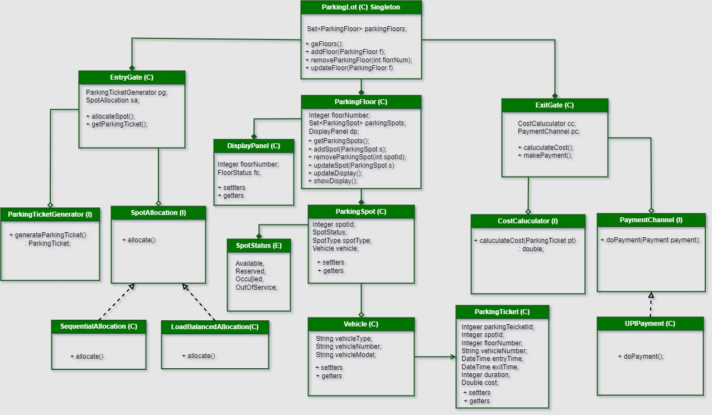

# 🚗 Parking Lot System Design

A scalable and object-oriented Parking Lot Management System that automates vehicle check-in/check-out, parking spot allocation, real-time availability display, and parking fee calculation.

---

## 📌 Functional Requirements

1. **Parking Spot Allocation**
    - Automatically assign an available parking spot based on vehicle size (motorcycle, car, bus).
    - Uses allocation strategies (sequential, load-balanced).

2. **Check-In and Check-Out**
    - Record vehicle `entryTime` and `exitTime` using a Parking Ticket.
    - Assign and release parking spots dynamically.

3. **Parking Fee Calculation**
    - Charges computed based on vehicle type and duration of stay.
    - Pluggable cost calculator logic.

4. **Real-Time Availability Updates**
    - Display panel updates floor status (`Available`, `Full`, `Maintenance`).
    - Supports multiple floors and dynamic spot updates.

---

## 🧱 Class Diagram Overview



---

## 🛠️ Core Design Components

### 🔹 EntryGate
- Handles vehicle entry and triggers:
    - Spot allocation (`SpotAllocation`)
    - Parking ticket generation (`ParkingTicketGenerator`)

### 🔹 ExitGate
- Calculates parking cost (`CostCalculator`)
- Processes payment (`PaymentChannel`)

### 🔹 ParkingLot (Singleton)
- Maintains a collection of `ParkingFloor` objects.
- Manages floor and spot updates.

### 🔹 ParkingFloor
- Contains a collection of `ParkingSpot` instances.
- Updates display panel for real-time availability.

### 🔹 ParkingSpot
- Has status (`Available`, `Occupied`, etc.), type, and associated vehicle.
- Updated on vehicle entry/exit.

### 🔹 ParkingTicket
- Records:
    - Spot and floor assigned
    - Entry and exit timestamps
    - Duration and calculated cost

---

## 💡 Allocation Strategy

- **SequentialAllocation**: Assigns the first available spot in order.
- **LoadBalancedAllocation**: Distributes load evenly across floors.

Both implement the `SpotAllocation` interface to allow plug-and-play behavior.

---
## Payment Channel

- **PaymentChannel**: Interface for payment processing.
- **CashPayment**: Implements cash payment logic.
- **CardPayment**: Implements card payment logic.
- **UPIPayment**: Implements UPI payment logic.

---
## 🚀 Getting Started
### clone the repository
```bash
git clone https://github.com/shanmuka089/ParkingLotSystem.git
```
### navigate to the project directory
```bash
cd ParkingLotSystem
```

### build the project
```bash
gradle clean build
```
### run the application
```bash
gradle run
```